<div align="center">

# SmartFit

**iOS fitness app — personalized workouts, HealthKit stats, Firebase auth**

[](https://swift.org/blog/swift-6/)
[](https://developer.apple.com/ios/)
[](https://firebase.google.com)
[](https://developer.apple.com/healthkit/)



</div>

---

## Overview

SmartFit tracks and improves workout habits through personalized goal-setting, equipment-aware exercise planning, and HealthKit-powered session stats. Users sign in via Google, define muscle-group targets, select gym machines, and view progress over time.

## Features

| Feature | Status | Technology |
|---|---|---|
| Google Sign-In | ✅ Live | Firebase Auth + GoogleSignIn 7 |
| Personalized goal setting | 🔨 In progress | Custom `PreferenceModel` (chest, arms, legs, back, abs) |
| Machine selection | 🔨 In progress | Life Fitness API |
| HealthKit stats (HR, calories, steps) | 🔨 In progress | HealthKit framework |
| Progress charts | 🔨 In progress | Apple Fitness framework |
| Workout reminders | 📋 Planned | `UserNotifications` |

## Tech Stack

- **Swift 6.3** — strict concurrency, `async`/`await` throughout auth flow, `@MainActor` UI isolation
- **Firebase 11** — `FirebaseCore` + `FirebaseAuth` for credential management
- **GoogleSignIn 7** — modern `signIn(withPresenting:)` async API, no delegate pattern
- **HealthKit** — per-session and aggregate stat collection
- **CocoaPods** (migrating to Swift Package Manager)

## Architecture

```
SmartFit/
├── AppDelegate.swift           # @main entry, FirebaseApp.configure(), URL routing
├── LoginViewController.swift   # Google Sign-In (@MainActor, async/await)
├── ViewController.swift        # Main dashboard entry point
└── Models (planned)
    ├── PreferenceModel         # Body-area targets, goal weight/time
    ├── WorkoutStats            # Session aggregator
    └── MachineStats            # Per-machine DataTracker
```

## Data Model

```
User
├── PreferenceModel
│   ├── chest / legs / arms / back / abs  (Int)
│   ├── goal_weight                       (optional)
│   └── goal_time                         (optional)
└── WorkoutStats
    ├── total_stats: DataTracker
    └── machine_stats: [MachineStatsModel]
        └── DataTracker
            ├── weight
            ├── heart_rate
            ├── calories_burned
            ├── time_duration
            └── steps
```

## Getting Started

```bash
git clone https://github.com/CPF-17/SmartFit.git
cd SmartFit
pod install
open SmartFit.xcworkspace
```

Add `GoogleService-Info.plist` from your Firebase console (iOS app → Project Settings) before building.

**Requirements:** Xcode 16+, iOS 17+ deployment target, CocoaPods

## Team

Built by [CPF-17](https://github.com/CPF-17) at UC San Diego
